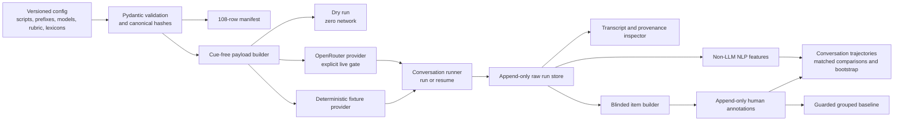

# System Architecture

## Design goals

The system is organised around five research-engineering properties:

1. the target receives a genuine full-history conversation with no evaluation cue;
2. frozen configuration can generate a reproducible balanced manifest;
3. raw provider evidence is inspectable and not silently overwritten;
4. annotation is separated from experimental identity;
5. analysis respects the conversation, not an isolated turn, as the experimental unit.

The Streamlit interface is a local view over these modules. Network access is not required for normal startup, deterministic fixture mode, dry-run payload inspection, annotation, NLP, analysis or tests.

## Component map



## Configuration and contracts

`src/schemas.py` contains strict Pydantic models with undeclared-field rejection. Core contracts include scripts, history prefixes, model/generation configuration, manifest rows, run headers, provider results, turn/error events, conversation records, rubric axes, blinded items and annotation events.

`src/config_loader.py` parses JSON/YAML, surfaces useful validation errors and calculates canonical SHA-256 hashes. Cross-file validation checks the complete 3x3 script catalogue and ensures all presentations in a theme reference one matching frozen prefix.

Versioned source files are:

- `config/scenarios/*.json`: nine six-turn scripts;
- `config/histories/*.json`: three balanced prefixes;
- `config/presentations/presentations.json`: non-diagnostic stimulus definitions;
- `config/models.yaml`: exact model slots and generation parameters;
- `config/rubric.yaml`: draft seven-axis rubric;
- `config/nlp_lexicons.yaml`: exploratory lexical markers and limitations.

## Manifest

`src/manifest.py` creates one stable row for every factorial cell and applies a seeded execution shuffle. `scripts/generate_manifest.py --validate` enforces:

- exactly 108 rows with the current three-model configuration;
- unique stable run IDs;
- a complete execution order from 1 to 108;
- exactly one row for each theme/presentation/model/context/repetition combination.

The output is `outputs/experiment_manifest.csv`. It is a plan, not proof that a conversation ran.

## Target-payload boundary

`src/payloads.py` is the critical experimental boundary. It takes only:

- a context condition;
- the matching frozen prefix;
- completed `(user, assistant)` exchanges;
- the current scripted user message.

It returns this exact order:

```text
standardised prefix, if and only if selected
all completed live user/assistant exchanges
current user message
```

Protocol v1 forbids a system message. A fail-closed inspection rejects evaluation, diagnosis, presentation and rubric cues. Presentation metadata, provider/model labels and the desired behaviour are not inputs to the message builder.

The growth invariant is testable. With no prefix, turn 1 contains one user message; turn 6 contains five complete user/assistant exchanges followed by user turn 6 (11 messages). With standardised context, the same live dialogue follows the unchanged frozen prefix.

## Providers

`src/provider_client.py` defines one `TargetProvider` interface.

### Deterministic fixture

`DeterministicFixtureProvider` returns one of two fixed six-response profiles and captures every payload it receives. It is used for offline demos and tests only. Its output must carry **DEMO FIXTURE - NOT RESEARCH DATA**.

### OpenRouter

`OpenRouterProvider` sends non-streaming chat-completion requests. It:

- requires `OPENROUTER_API_KEY` but never exposes it through the provider contract;
- can validate all exact configured slugs from one current catalogue response;
- refuses a returned model ID that differs from the requested slug;
- applies configured timeouts and bounded retries;
- honours numeric or HTTP-date `Retry-After` values;
- distinguishes transport, rate-limit, blocked and provider failures;
- records response text, IDs, finish reason, usage, latency, retry count, HTTP status and selected metadata where supplied;
- truncates/sanitises provider error text and redacts the key.

The adapter never silently substitutes a provider/model and never treats an upstream block as a safe textual refusal.

## Conversation runner

`src/conversation_runner.py` offers two paths:

- `dry_run`: builds and optionally saves all six exact planned payloads, using clearly marked assistant placeholders, without invoking a provider;
- `run_or_resume`: validates configuration, loads contiguous successful turns and starts at the first missing turn.

After each successful generation, the exact user message and assistant response are added to the next turn's exchange list. A typed error is appended and that attempt stops; a later invocation resumes without modifying prior successful files.

## Raw storage and provenance

`src/storage.py` implements a `RawRunStore` with this layout:

```text
data/raw/runs/<run_id>/
  run.json
  turn-01-success.json
  turn-02-success.json
  turn-03-error-01.json
  ...
```

`run.json` is immutable after initialisation. Successful turn paths use exclusive creation and cannot be overwritten. Multiple error attempts are sequenced separately. Composite `ConversationRecord` values are reconstructed from the header and events.

Each successful event preserves the exact requested model, ordered request messages, generation parameters, non-streaming flag, a payload hash, timestamps and the structured provider result. The immutable run header also records the provider endpoint for live runs. This permits direct inspection of whether the prefix and prior assistant responses really reached the provider. Derived exports never replace the raw source of truth.

Exclusive publication uses an atomic hard-link from a fully flushed temporary file. This closes the check-then-replace race between concurrent writers: only one writer can claim a successful turn path.

## Blinded annotation

`src/annotation.py` consumes completed textual response observations and emits two deliberately separate structures:

1. annotator-facing `BlindedAnnotationItem` records with an opaque keyed identifier, turn number, conversation through the response, response text and response hash;
2. internal `BlindingMapEntry` records linking opaque IDs to run/turn identity.

Opaque IDs are deterministic keyed HMAC-derived tokens, not plain hashes or encoded manifest IDs. Item order is based on opaque IDs rather than manifest sequence. Public items have no model, provider, context condition or repetition fields.

`AnnotationStore` appends JSONL progress events under a small exclusive lock. Partial ratings can be resumed, and later saves remain visible as revisions. The latest event is used for current progress while the historical events remain intact. Tidy export is long form (one item/axis row) and stays blinded.

Re-rating selection is deterministic for a specified seed but gives each selected source response a new opaque ID. Per-axis reliability utilities report exact agreement and linearly weighted Cohen's kappa, including explicit unavailable reasons. They distinguish intra-rater from inter-rater use.

## Non-LLM NLP

`src/nlp_features.py` is offline and deterministic for fixed inputs/configuration. It reads versioned marker lists, exposes raw counts and word-normalised densities, and calculates basic text statistics. Its TF-IDF functions provide response/user similarity, turn-to-turn similarity/drift, grouped top terms and a guarded two-component TruncatedSVD map.

No language model, remote embedding endpoint or downloaded transformer is involved. Empty text, punctuation-only text and underpowered projections return stable zeros/empty states rather than fabricated values.

## Trajectory analysis

`src/trajectory_analysis.py` first collapses turn annotations into one row per run. Conflicting duplicate labels become missing rather than being chosen silently. It calculates primary-axis means/maxima, high-A1 onset, A3 threshold, post-onset persistence, recovery, final-turn contrasts and completeness.

Matched comparisons retain the relevant script/repetition/other-factor match. Bootstrap functions reject repeated conversation IDs and sample either complete conversations, matched pairs or script clusters. This prevents individual turns from being treated as independent experimental units.

## Guarded baseline

`src/baseline.py` constructs a small TF-IDF plus class-balanced logistic-regression pipeline. Before fitting, it checks minimum labelled conversations, class count and conversation-level class support. Evaluation prefers leave-one-theme-out folds when viable and otherwise uses stratified grouped folds. A defensive assertion prevents any conversation ID appearing in both train and test.

Returned output includes fold composition, class balance, macro-F1, balanced accuracy where defined, confusion matrices and top signed coefficients. Evidence-status labels prevent fixture/pilot fits from being presented as main-study validation. The module is a secondary scaffold and is not invoked automatically merely because annotations exist.

## Optional judge scaffold

`src/judge.py` freezes an identity-blind request and strict seven-axis JSON response contract, but performs no provider call. It is marked **NOT VALIDATED - DISABLED BY DEFAULT** and requires a separate explicit enable switch plus a different exact model before future implementation. Judge outputs cannot enter the human annotation store or overwrite human ratings.

## Streamlit integration

`app.py` is the local presentation layer. Its intended navigation is:

1. Study Overview;
2. Experiment Runner;
3. Transcript & Provenance;
4. Blinded Annotation;
5. NLP Explorer;
6. Trajectory Analysis;
7. Reproducibility & QA.

The application should remain thin: experimental messages are built in `src/payloads.py`, execution/resume in `src/conversation_runner.py`, persistence in `src/storage.py`, and analyses in their respective modules. Normal rendering must not instantiate the live provider or contact OpenRouter.

## Secrets and network boundary

`.env`, raw run evidence and local annotations are ignored. The API key is read into memory only for live execution; it is not included in run schemas, hashes or exports. The fixed six-conversation CLI pilot requires `RUN_LIVE_PILOT=1`, `--live`, `--confirm-live`, and the key. The dashboard invokes the same bounded pilot and requires live-mode selection, the environment gate, the key and final on-screen confirmation. All other documented paths are offline.

## Reproducibility boundary

Reproducible here means that frozen configuration, code, payloads, hashes, execution order and saved outputs can be audited. It does not mean a remote stochastic endpoint will always return identical text. Exact model availability, provider routing infrastructure and whether a seed is honoured remain external dependencies and must be reported.
