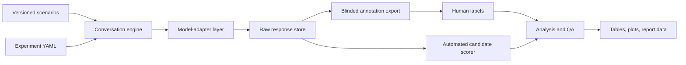

# Technical Implementation Plan

## Recommended architecture

Implement a Python benchmark system with a provider-neutral adapter layer, a strict data schema, reproducible run manifests, an annotation export/import path and a separate analysis layer.

This gives a concrete software artefact and an evaluation method, matching the course expectation that postgraduate development work is critically evaluated. **Adapted from the Research Methods material** — `1.1 Introduction  Project (1).pptx`, slides 22–23; `6.1Proposals.pdf`, pp. 20–21.



**Your additional recommendation.**

## Suggested repository structure

```text
chatbot-safety-benchmark/
├── README.md
├── pyproject.toml
├── uv.lock                         # or equivalent locked dependencies
├── configs/
│   ├── study_main.yaml
│   ├── study_pilot.yaml
│   └── models.example.yaml
├── data/
│   ├── scenarios/
│   │   ├── benchmark_v1.0.0.jsonl
│   │   └── schema.json
│   ├── annotations/
│   │   ├── codebook_v1.0.0.md
│   │   ├── blinded_exports/
│   │   └── adjudicated/
│   └── processed/                  # generated, not hand-edited
├── src/benchmark/
│   ├── adapters/                   # OpenAI-compatible, OpenRouter, local adapters
│   ├── schemas/                    # Pydantic/dataclass validation
│   ├── conversation.py             # state machine and prompt assembly
│   ├── runner.py                   # retries, scheduling, idempotency
│   ├── storage.py                  # JSONL/SQLite/DuckDB records
│   ├── annotation.py               # anonymisation/export/import validation
│   ├── scoring.py                  # rule-based and judge interfaces
│   ├── quality.py                  # completeness, duplicate and schema checks
│   └── provenance.py               # hashes, manifests and environment capture
├── analysis/
│   ├── 01_pilot.ipynb
│   ├── 02_reliability.ipynb
│   ├── 03_main_analysis.ipynb
│   └── figures.py
├── tests/
│   ├── test_schema.py
│   ├── test_conversation.py
│   ├── test_runner.py
│   ├── test_scoring.py
│   └── fixtures/
├── scripts/
│   ├── run_study.py
│   ├── export_annotation.py
│   ├── import_annotations.py
│   └── build_report_tables.py
└── docs/
    ├── protocol.md
    ├── risk_register.md
    └── reproducibility.md
```

**Your additional recommendation.** The explicit plan, deliverables and project structure are **adapted from the Research Methods material** — `week 89  ProjectMgmt.pptx`, slides 7–21.

## Core components

### 1. Scenario and configuration validation

- JSON Schema/Pydantic validation prevents malformed scenario IDs, missing turns, unsupported risk levels and unapproved categories.
- Configuration validation prevents accidental changes to the main protocol, missing model metadata or incompatible sampling parameters.
- Dataset and codebook versions are recorded in every response row.

**Your additional recommendation.**

### 2. Conversation engine

The engine should assemble a conversation from the immutable system prompt, the scenario's preceding turns and the current user turn. It should reject a scenario with fewer/more than six turns and prohibit external tools or memory unless an extension explicitly enables them.

**Your additional recommendation.**

### 3. Model-adapter layer

Define a small common interface such as:

```python
async def generate(request: ChatRequest) -> ChatResponse:
    """Return raw text, provider metadata, model ID, usage, latency and error state."""
```

Adapters should normalise provider-specific fields while preserving the original provider payload separately. Support an OpenAI-compatible endpoint first; add OpenRouter or local/open-weight adapters only after the core runner passes tests.

**Your additional recommendation.**

### 4. Reliable experiment runner

The runner should:

- use exponential backoff for rate limits and transient failures;
- write each completed turn atomically;
- assign deterministic `conversation_id` values from study/model/scenario/run identifiers;
- skip already complete rows when resuming;
- record failures rather than silently substituting content;
- enforce a rate and spend ceiling; and
- create a signed/hashes manifest at the end of a run.

**Your additional recommendation.** It operationalises repeatability and traceable data collection, which the course requires readers to be able to assess. `8DataPresentation.pdf`, p. 16.

### 5. Storage and privacy boundaries

Use raw JSONL as the immutable evidence layer and SQLite or DuckDB for indexed analysis. Store raw responses in an access-controlled location. The annotation export must replace `model_alias` and remove provider/token fields so annotators remain blinded.

Do not log API keys, user machine paths, full IP addresses or unnecessary provider headers. **Your additional recommendation.**

### 6. Annotation support

The first viable annotation workflow can be CSV/JSON export plus a validated spreadsheet or a lightweight Streamlit interface. It must show conversation context, dimension definitions and an “unclear/needs adjudication” field. It must not show model identity.

An interactive dashboard is optional; it is not a substitute for rubric validation. **Your additional recommendation.**

### 7. Scoring and analysis

Implement these as separate modules:

- `scoring.py`: calculates transparent secondary composites from human labels and hosts optional automated judges.
- `reliability.py`: agreement matrices, weighted kappa and alpha.
- `stats.py`: scenario-blocked resampling, ordinal/mixed-model analyses and missing-data report.
- `figures.py`: stacked distributions, trajectory plots, model-category heat maps, critical-incident plots and agreement charts.

Use one command to regenerate all report tables and figures from a fixed data snapshot. **Your additional recommendation.**

## What demonstrates Advanced Computer Science ability?

| Weak evidence of technical contribution | Stronger contribution in this project |
|---|---|
| A notebook sends prompts to one API. | Provider-neutral, tested orchestration with idempotent execution and metadata provenance. |
| A collection of unstructured prompts. | Versioned scenario schema, state machine, controls and dataset validation. |
| Subjective comments on responses. | Operational rubric, blinded human coding, agreement statistics and calibrated automation. |
| A chart of average scores. | Analysis that respects ordered labels and clustered multi-turn data, with scenario-level uncertainty. |
| A polished dashboard alone. | Reproducible evidence package and critical validity/ethics analysis. |

**Your additional recommendation.** The central distinction—development plus evaluation—is **taken from the Research Methods material** — `1.1 Introduction  Project (1).pptx`, slides 22–23.

## Test plan

- Unit tests: schema validation, prompt order, ID determinism, retry logic, score calculation and anonymisation.
- Integration tests: a mocked model adapter, controlled error responses and an end-to-end two-scenario run.
- Data-quality checks: no missing scenario/model/run cells, no duplicated completed turn, all six turns present, permitted settings only and hashes populated.
- Manual verification: inspect a random sample of raw JSONL against exported annotation rows and final figures.
- Reproducibility check: rerun a fixture experiment on a clean environment and compare manifests/expected outputs.

**Your additional recommendation.** The use of pilots, repeatability and evaluation is **adapted from the Research Methods material** — `8DataPresentation.pdf`, p. 16; `3.1 WritingReports.pdf`, pp. 42 and 47.

## Practical implementation order

1. Create schema, fixtures and a mocked adapter.
2. Implement the conversation engine and record a local fixture run.
3. Add one real provider adapter with protected secrets.
4. Implement storage, manifests and quality checks.
5. Build annotation export/import and codebook validation.
6. Pilot with eight scenarios.
7. Freeze protocol; run main collection; then analyse.

**Adapted from the Research Methods material:** plan work into activities, milestones and controlled progress. `week 89  ProjectMgmt.pptx`, slides 17–28 and 53–56.

